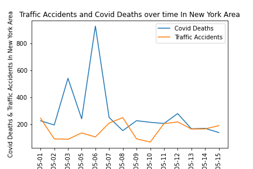
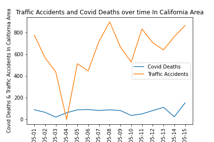
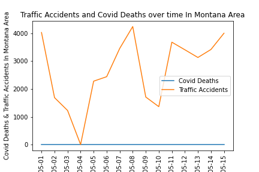

# 
 ETL: Traffic and Covid 

## 
 Exploring relationships between traffic accidents and Covid-19 pandemic. 

### 
 Goal 

An analysis was conducted to determine if a relationship between traffic accidents and Covid-19 fatalities can be observed. Traffic and Covid-19 fatality data was collected from May 1 St , 2020 to May 15th, 2020 and compiled into SQL database for analysis. This enabled the ability to identify potential relationships between severe virus activity (deaths) and shifts in traffic accident occurrence.  This study was limited to New York, California, and Indiana to validate the data collected. The database contains data for the United States which would enable additional studies. 
#### 
 Sources 

  
  1. [Accident Information](https://www.kaggle.com/sobhanmoosavi/us-accidents?select=US_Accidents_June20.csv)
     - This is a countrywide car accident dataset, which covers 49 states of the USA. The accident data are collected from February 2016 to June 2020, using two APIs that provide streaming traffic incident (or event) data. These APIs broadcast traffic data captured by a variety of entities, such as the US and state departments of transportation, law enforcement agencies, traffic cameras, and traffic sensors within the road-networks. Currently, there are about 3.5 million accident records in this dataset.
     - US_Accidents_June20.csv
     - Kaggle
     - 1.24 gb
     - Columns: ID, Start Time, City, County, State
  2. [Covid Data](https://www.kaggle.com/sudalairajkumar/covid19-in-usa)
     - Data is obtained from COVID-19 Tracking project and NYTimes. Sincere thanks to them for making it available to the public. Coronaviruses are a large family of viruses which may cause illness in animals or humans. In humans, several coronaviruses are known to cause respiratory infections ranging from the common cold to more severe diseases such as Middle East Respiratory Syndrome (MERS) and Severe Acute Respiratory Syndrome (SARS). The most recently discovered coronavirus causes coronavirus disease COVID-19. This dataset has information from 50 US states and the District of Columbia at daily level.
     - us_counties_covid19_daily.csv
     - Kaggle
     - 7 mb
     - Columns: Deaths, Time, City, State

#### 
 Tasks 

  - [x] Create Repository
  - [x] Create Slack Channel
  - [x] Pare down Accident Database in Pandas, as size prevents uploading to Github, then upload this to the Github
    - [x] Remove Unneeded columns and dates and create new CSV with only relevant data
  - [x] Convert CSV's to Dataframes
    - [x] Normalize Timestamps in both Dataframes to only include YYYY-MM-DD
  - [x] Create SQL Database
  - [x] Move data to SQL
  - [x] Manipulate data
    - [x] Created new column in Covid dataframe to add 2 letter State abbreviations.
    - [x] Group by dates in both dataframes
  - [x] Plot both deaths and accidents versus date in a line plot.
  - [x] Write up an analysis

#### 
 Replication Steps 

1. Download Full CSV's fro sources above.
2. Run AccidentData.ipynb to pare down Accident Data to a usable data size
3. Run DataTransform.ipynb to transform dates in both CSV's to the proper format
4. Run CreateTablesETL.sql in postgres
5. Import accident_data_new.csv and us_counties_covid19_daily.csv into accident_df and covid_df respectively
6. Run transformSQL.sql for covid_df to create a column with 2 letter state abbreviations.
7. transformSQL.sql adds in a column that calculates new deaths per day as well. This was necessary for our purposes.
8. Run first 4 cells of plotsSQL.ipynb to abbreviate data in both dataframes to the timeframes we are charting. This will generate 2 CSV's for use in plotting.
9. Run PLOT_covid_data_pH.ipynb to plot data on line graph

#### 
 Analysis 

Based on pairing New York traffic accident data and covid data, no connection was found between the two sets of data for the proscribed dates that were examined. Each appear to fluctuate independently of one another, despite hypotheses to the contrary. The effects of any procedures put into place to effect a lockdown and societal pressures appear to have not affected traffic accidents as anticipated.

California data showed the same lack of connection between datasets. They fluctuated wildly, but neither set of data appeared to correlate, positively or negatively.

Indiana's data was by far the most interesting, but no correlation appears to be in place. Covid deaths exceeding traffic accidents was quite a surprise. 

This database allows for quick comparison of covid and traffic data for any of the 50 states thanks to the steps taken in cleaning up the data and transforming it.   
